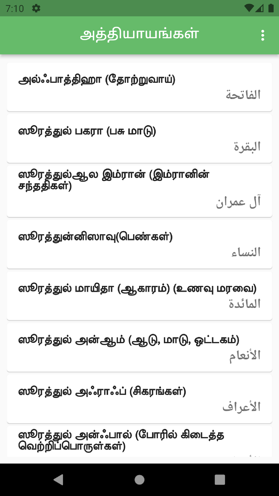
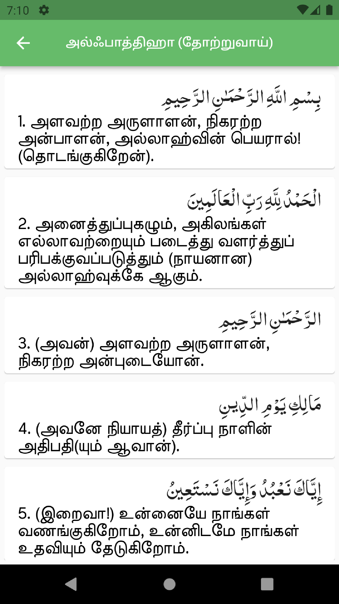
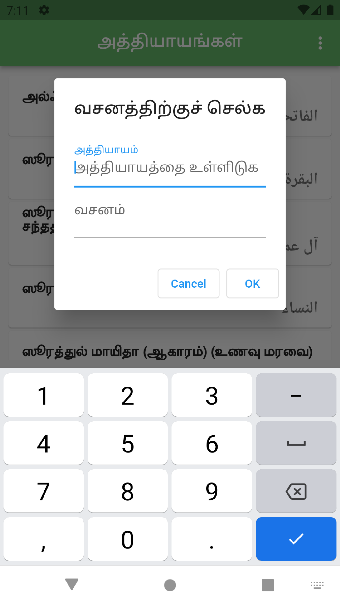
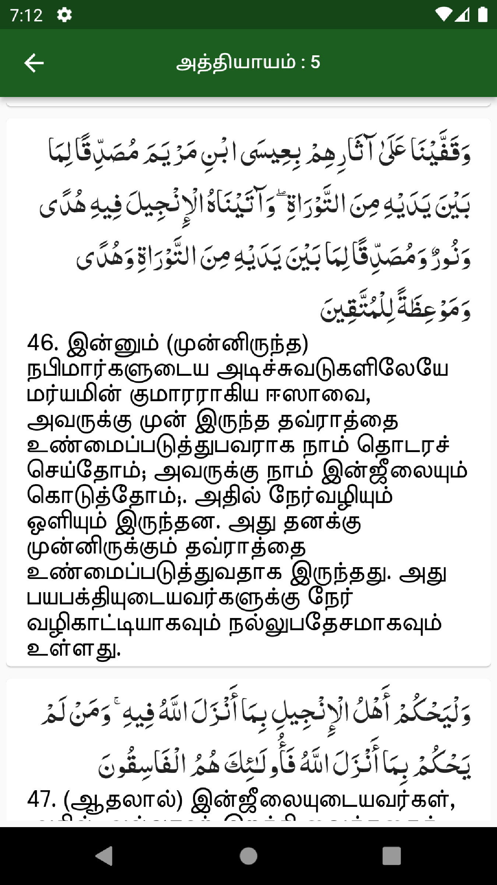
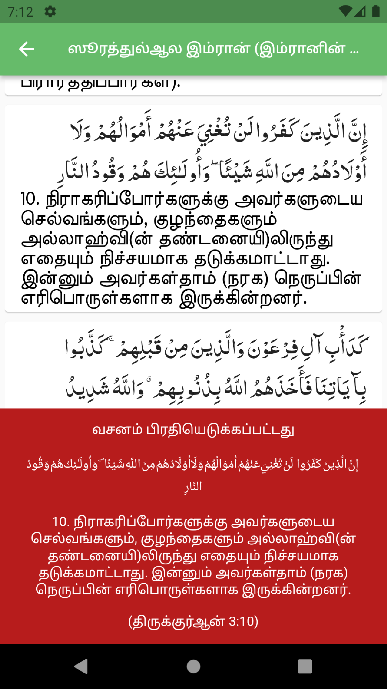

# Tamil Quran (திருக்குர்ஆன் தமிழாக்கம்)

**'Tamil Quran'** is an Android app made with Flutter.
This app is a spin off from my previous app 'Sri Lankan prayer times'.
Now it comes as a seperate app.

Read Holy Quran in Arabic and read the translation in Tamil.

## Credits:

Translated by : *Muhammad John Trust.*

## Features
- Read Quran in Arabic.
- Read translation in Tamil.
- Go to verse (go to a particular verse by just entering the chapter and verse numbers).
- Copy verse. (copy the text of a selected verse in Arabic and Tamil and share it anywhere by pasting it).

## *Screenshots of 'Tamil Quran'.*

  
   
  
  
  

