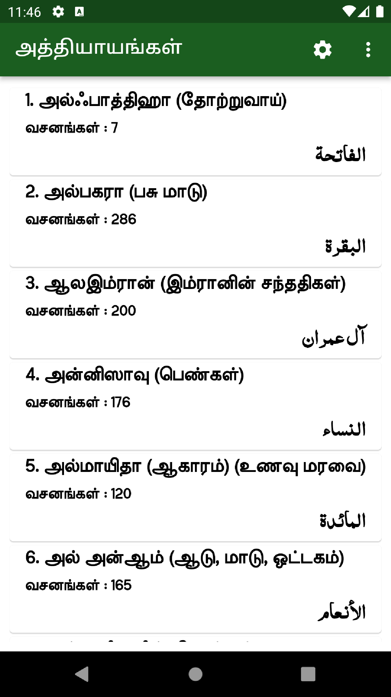
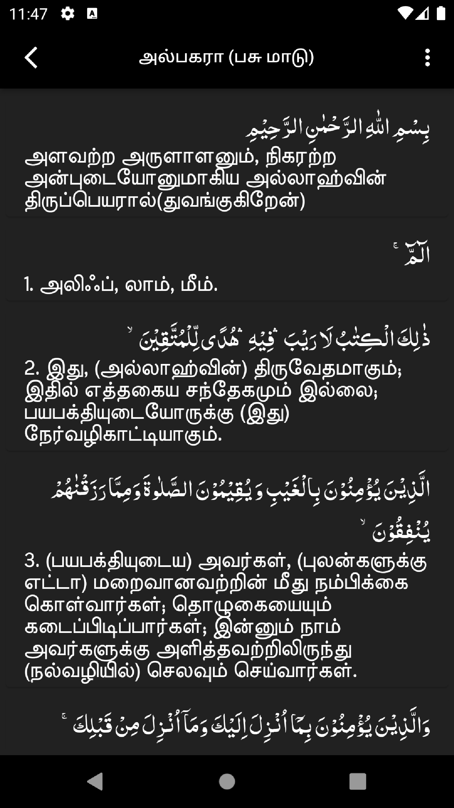
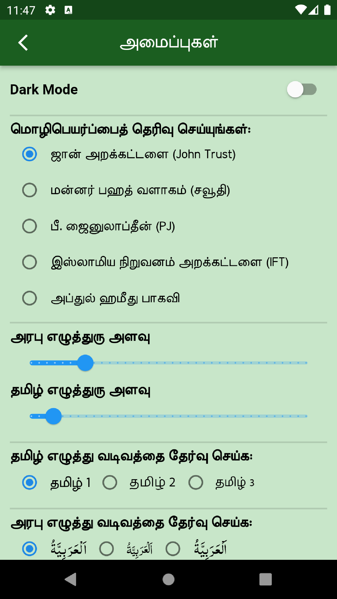
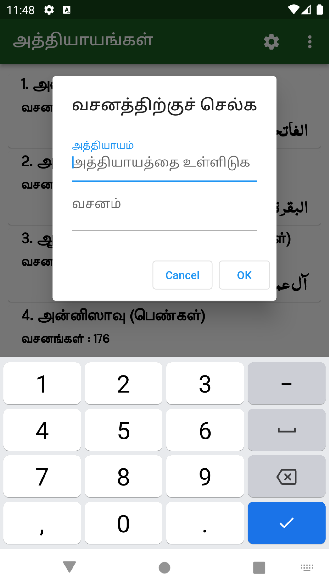
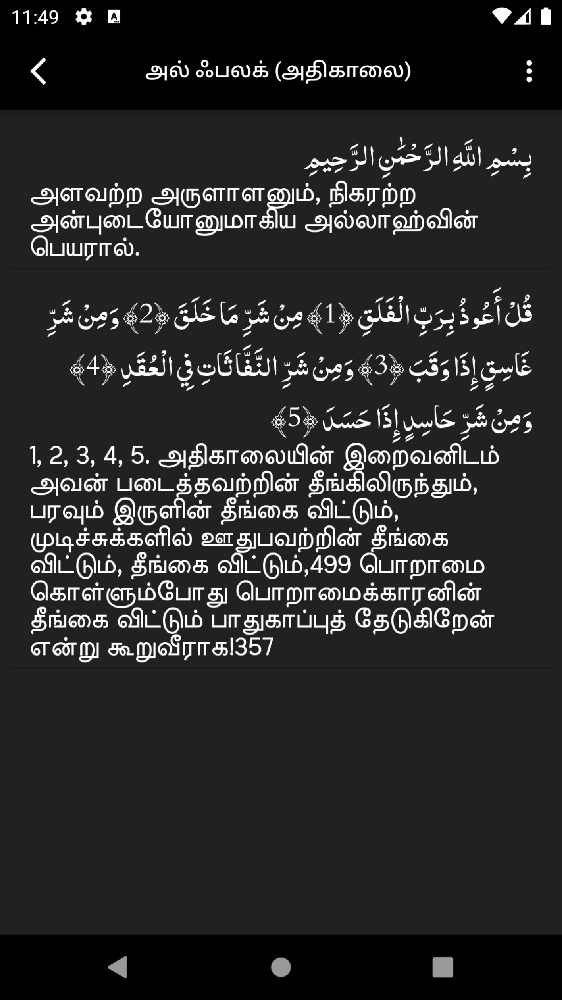
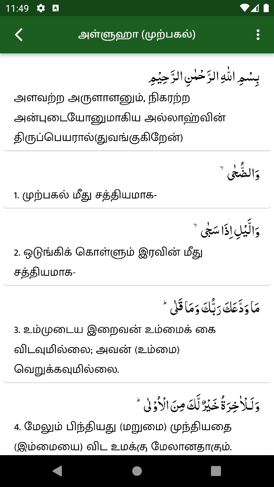

# Tamil Quran (திருக்குர்ஆன் தமிழாக்கம்)

Read Holy Quran in Arabic and read the translation in Tamil.

## Credits:

Availabe Translations : 
- *Muhammad John Trust.*
- *King Fahd Quran Complex (Saudi)*
- *P. Jainulabdeen (PJ)*
- *Islamic Foundation Trust*
- *Abdul Hameed Baqavi*

## Features
- Read Quran in Arabic.
- Read translation in Tamil.
- Change Translation.
- Go to verse (go to a particular verse by just entering the chapter and verse numbers).
- Change Tamil Font.
- Change Arabic Font.
- Change Font Size Arabic & Tamil.  
- Share Verse with Tamil meaning.

## *Screenshots of 'Tamil Quran'.*

  
   
  
  
  
  
  

